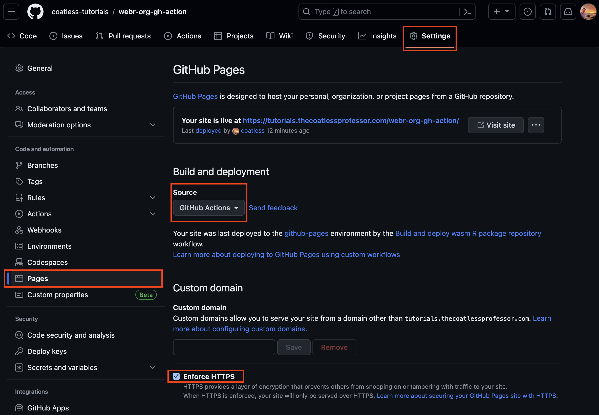
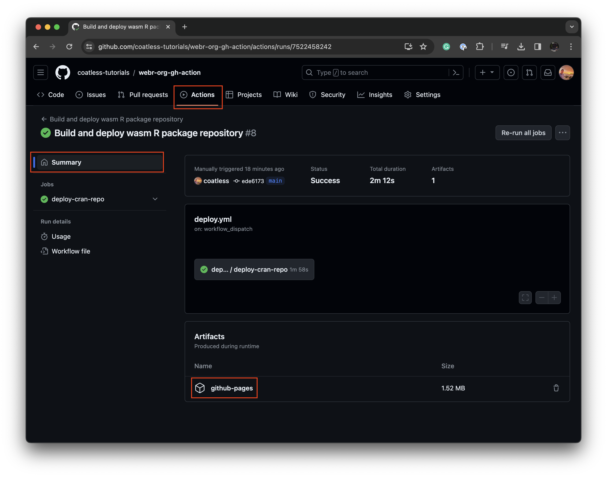

# GitHub Action for an Org webR WASM R Package Repository

This repository serves as an example that strictly follows the [guidance](https://r-wasm.github.io/rwasm/articles/github-actions.html) for setting up a mini-CRAN repo for webR R WASM Package binaries.

This repository is part of a series of repositories exploring the topic.

- **[Org-focused webR/WASM Package Repository without a `{pkgdown}` website (Preferred)](https://github.com/coatless-tutorials/webr-org-gh-action)  [This repository]**
- [Unified GitHub Action Deployment using artifacts of R WASM Package binaries and {pkgdown} website](https://github.com/coatless-tutorials/webr-unified-gh-workflow)
- [Separate GitHub Action Deployment onto `gh-pages` branch of R WASM Package binaries and {pkgdown} website](https://github.com/coatless-tutorials/webr-github-action-wasm-binaries)


## Setup `packages`

When trying to setup an environment for your own packages, please make sure to modify the `packages` file to contain the appropriate [package reference value supported by `pak`](https://r-lib.github.io/pkgdepends/reference/pkg_refs.html). In the case of generating [R WASM package binaries from GitHub](https://r-lib.github.io/pkgdepends/reference/pkg_refs.html#github-packages-github-), you can achieve this with: 

```
gh-username/reponame
```

Or, more formally with: 

```
github::gh-username/reponame
```

Need a [package from CRAN](https://r-lib.github.io/pkgdepends/reference/pkg_refs.html#cran-packages-cran-)? This can be specified as: 

```
pkgname
```

So, the example `packages` file contains three lines where 2 are dedicate to install a package on GitHub as well as CRAN and the last line is an empty line:

```
coatless-rpkg/drawr
visualize

```

**Note:** Not leaving an empty line will result in a warning message during the "Retrieve packages from `./packages` file" step.

```
Warning message:
In readLines("./packages") : incomplete final line found on './packages'
```

## Setup Github Pages on the Repository

After the desired packages are specified, the next step is to enable GitHub Pages for the repository.

1. Click on the **Settings** tab for the repository
2. Under "Code and automation", select the **Pages** menu item.
3. Under the "Source" option select **GitHub Action** from the drop down.
4. In the "Custom Domain" settings, make sure that **Enforce HTTPS** is checked.



## Trigger a build

The R WASM Package binaries are either built by updating/committing files in the repository or by manually triggering a workflow deploy.

You can trigger a workflow deploy by:

1. Go to the **Actions** tab of the repository
2. Select the **Build and deploy wasm R package repository** workflow
3. Click on **Run workflow** dropdown
4. Press the green **Run workflow** button.


## Observing Data Uploaded 

When the workflow completes, the packages and repository structure is uploaded onto GitHub Pages through
an artifact. The artifacts are stored for 90 days (by default) and can be found under the workflow
summary:

1. Click on the **Actions** tab for the repository
2. Select a completed build
3. Press the **Summary** option
4. Under "Artifacts", click on **github-pages** to download the built repository



**Note:** The size of the repository with only two R-based packages requires 1.52 MB of compressed space.

If you have permissions to the repository, you should be able to download the `github-pages` artifact
by clicking on the name above. This will trigger the download of `artifact.zip` that when extracted
will have the form of: 

```sh
├── bin
│   └── emscripten
│       └── contrib
│           └── 4.3
│               ├── PACKAGES
│               ├── PACKAGES.gz
│               ├── PACKAGES.rds
│               ├── mypackage_1.0.0.data
│               ├── mypackage_1.0.0.js.metadata
│               └── mypackage_1.0.0.tgz
└── src
    └── contrib
        ├── PACKAGES
        ├── PACKAGES.gz
        ├── PACKAGES.rds
        └── mypackage_1.0.0.tar.gz
```

where `mypackage_1.0.0` should resemble the names of the packages specified in the `packages` file setup above.

## Usage inside webR

Inside of a webR session, you can access the built binaries by using the
repository’s GitHub Pages URL, e.g.

```
https://gh-username.github.io/repo-name
```

This can be set either using `options()` or specifying the location in
each `webr::install()` call.

The easiest is probably to define the location webR should search for in
`options()`.

``` r
# Run once at the start of the session
options(
  repos = c("https://gh-username.github.io/repo-name", 
            "https://repo.r-wasm.org/")
)

# Call
webr::install("pkgname")
```

Otherwise, you can specify it each time:

``` r
webr::install("pkgname", "https://gh-username.github.io/repo-name")
```

<div>

> **Important**
>
> Please make sure the repository’s [GitHub Pages website is available
> over
> `HTTPS`](https://docs.github.com/en/pages/getting-started-with-github-pages/securing-your-github-pages-site-with-https#enforcing-https-for-your-github-pages-site)
> not `HTTP` (notice the lack of an `s`). You can verify this option was
> selected by:
>
> 1.  Going to the repository’s **Settings** page
> 2.  Selecting **Pages** under **Code and automation**
> 3.  Checking the **Enforce HTTPS** button.
>
> Otherwise, you will receive the error message of:
>
>     Warning: unable to access index for repository http://gh-username.github.io/repo-name/bin/emscripten/contrib/4.3

</div>

## Verify

Go to the [webR REPL Editor](https://webr.r-wasm.org/v0.2.2/) (pinned to
v0.2.2) and run the following:

``` r
# Check if package `{drawr}` is installed
"drawr" %in% installed.packages()[,"Package"]
# Install the binary from a repository
webr::install(
  "drawr", 
  repos = "https://tutorials.thecoatlessprofessor.com/webr-org-gh-action/"
)
# Check to see if the function works
mat_2x2 <- matrix(1:4, nrow = 2)
drawr::draw_matrix(mat_2x2, show_cell_indices = TRUE)
# View help documentation
?drawr::draw_matrix
```

You should receive:


